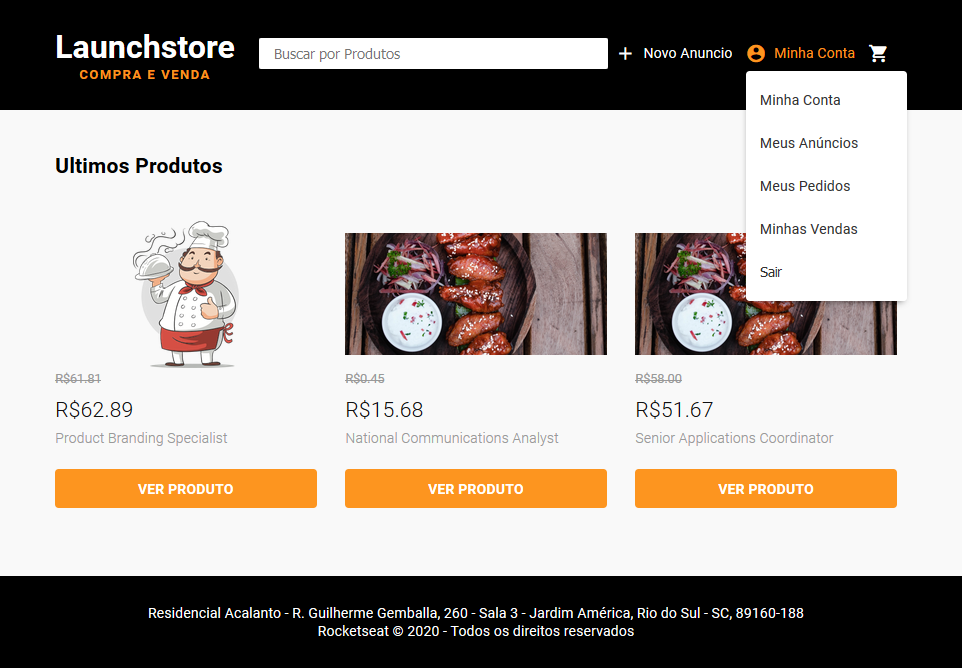
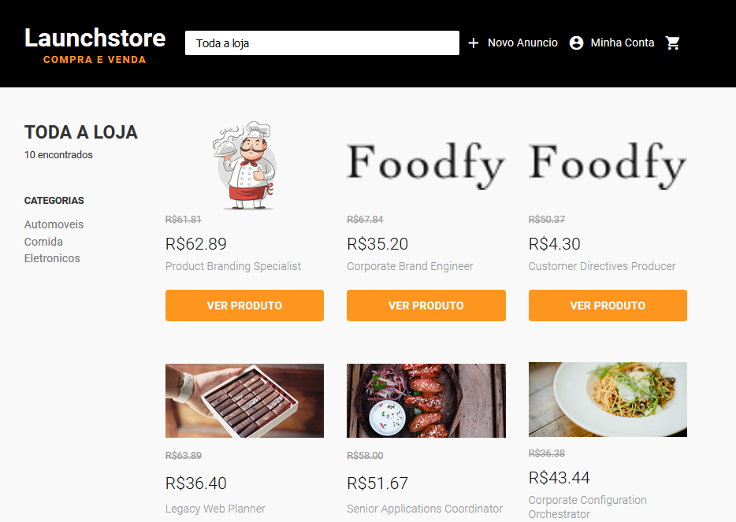
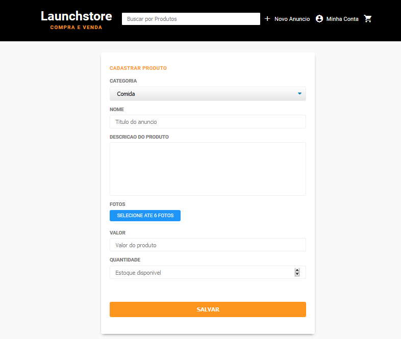
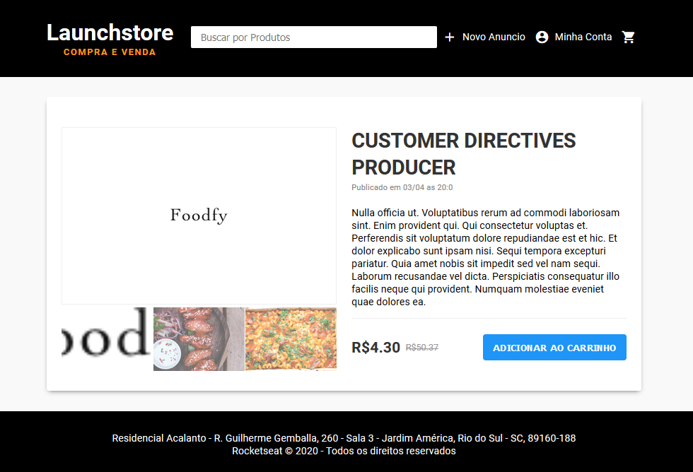
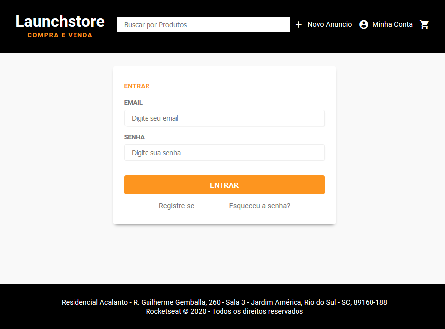
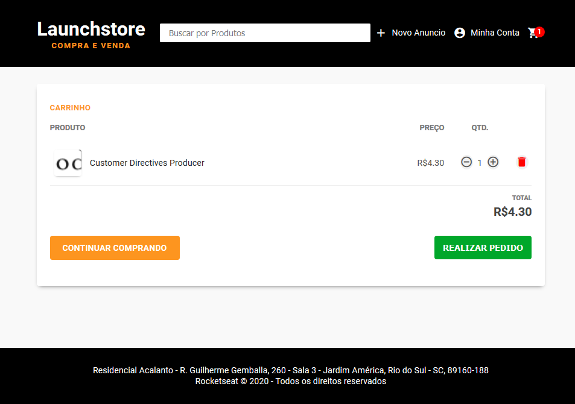
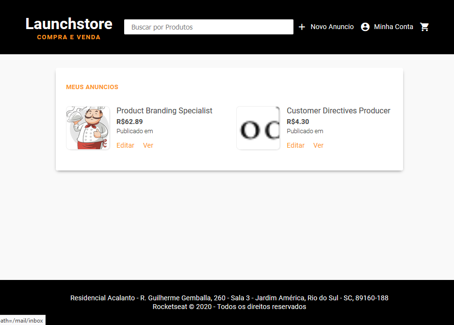
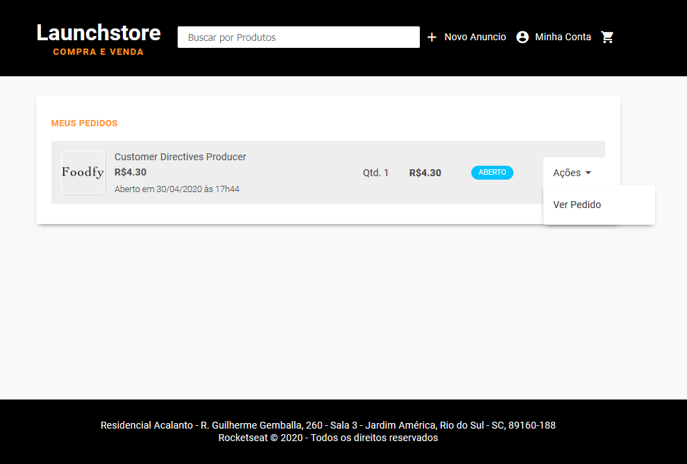
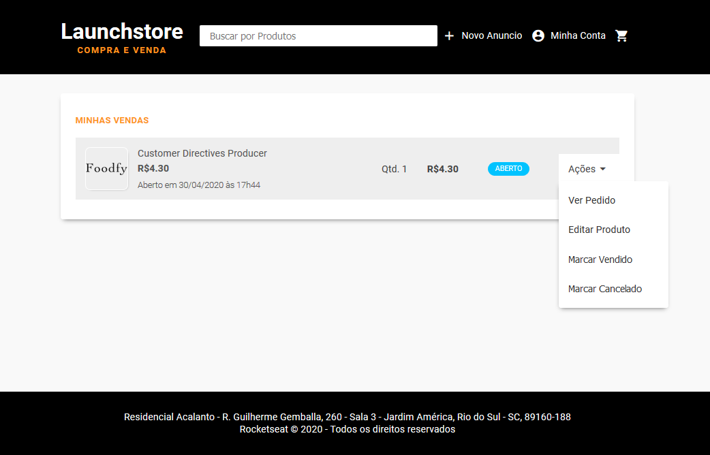
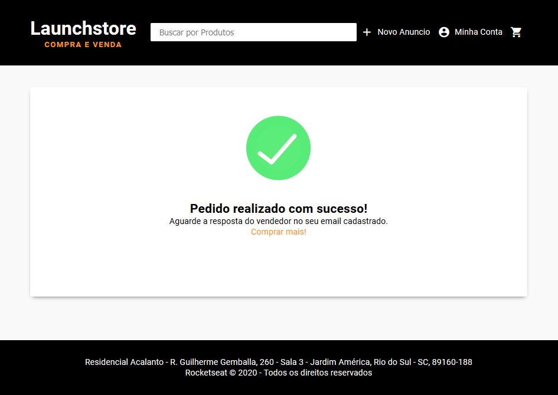

<h1 align="center">
    
</h1>

<h3 align="center">
  Launchstore
</h3>

## :speech_balloon: Description
Fictional Web Store application where you can advertise your product and sell it to a variety of users registered in the website. You can register yourself to the website and if you forget your password, we will email it to the registered email. You can buy other products selected by categories or sell your own products! Be sure to check it out!  

## :computer: Technologies

- [JavaScript](https://www.javascript.com)
- [HTML](https://www.w3.org)
- [CSS](https://www.w3.org/Style/CSS/Overview.en.html)
- [NodeJS](https://nodejs.org)
- [Postgres](https://www.postgresql.org/)

## Preview

<h1 align="center">
    
    
</h1>

<h1 align="center">
    
    
</h1>

<h1 align="center">
    
    
</h1>

<h1 align="center">
    
    
</h1>

<h1 align="center">
    
    
</h1>
---

by Matheus Coutinho :wave: 
